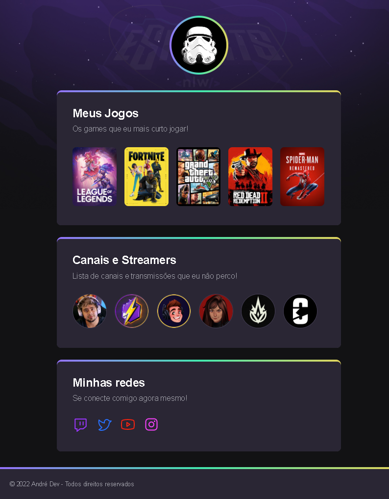

# NLW eSports

> Trilha Explorer

Projeto construido durante evento Next Level Week da Rocketseat.

🔗 [Clique aqui para acessar / Click here](https://uneighbor.github.io/nlw-esports-explorer)

## 🔨 Ferramentas (Tools)

- HTML
- CSS
- Git e Github

## 📚 Aprendizado (Learning)

Com uma semana intensiva dentro do evento Next Level Week promovido pela Rocketseat, aproveitei deste momento para estar treinando mais do meu HTML e CSS com a construção desse portifólio de games bem intuitivo e prático. Então agora apresento-lhes o resultado final desse pequeno projeto que pretendo estar atribuindo outras novas funcionalidades em breve. Espero que gostem! 😃

---

With an intensive week inside the Next Level Week event promoted by Rocketseat, I took advantage of this moment to be training more of my HTML and CSS with the construction of this very intuitive and practical games portfolio. So now I present you the final result of this little project that I intend to be adding other new features soon. I hope you like it! 😃

## 📫 Contatos (Contacts)

andredirval2701@gmail.com

https://www.linkedin.com/in/andrealves27

